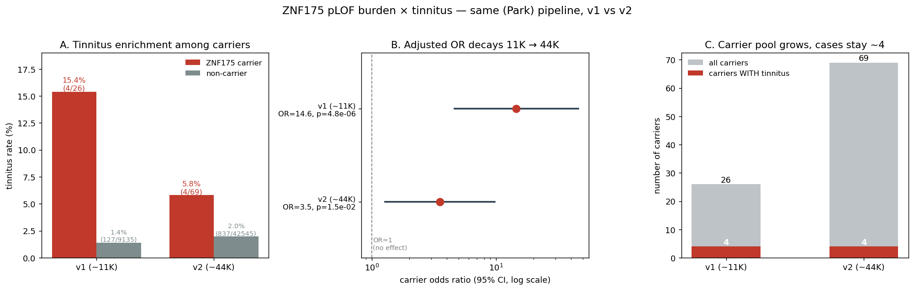

# ZNF175 → tinnitus: why the signal is strong at 11K (Park) and decays at 44K (Hui)

**TL;DR.** Applying **Park's pipeline identically** to both PMBB exome freezes, the ZNF175 pLOF burden is **strongly associated with tinnitus in the ~11K Freeze One** (Park's discovery cohort; adjusted *p* = 4.8×10⁻⁶) but **only weakly in the ~44K Release 2020 v2.0** (adjusted *p* = 1.5×10⁻²). The association does not vanish — it **regresses**. It is anchored on a small, fixed set of **~4 carrier-cases that do not grow with the cohort**, so the enrichment dilutes as more (phenotype-negative) rare carriers are added — a textbook **winner's-curse** pattern. Hui's apparent "loss" also reflects the **exome-wide significance bar** (*p* < 10⁻⁶), which the gene-focused v2 signal does not meet.

---

## Method

- **Same (Park) pipeline on both cohorts.** Qualifying variant = **pLOF** (VEP most-severe: frameshift / stop-gain / stop-loss / start-loss / canonical splice) with **cohort MAF ≤ 0.1%**. Carrier = ≥1 qualifying allele.
- **Outcome:** tinnitus phecode (ICD-9 `388.3x` / ICD-10 `H93.1x`), **rule-of-2** (≥2 distinct dates = case, never = control, 1 date = excluded).
- **Model:** logistic `tinnitus ~ carrier + age + age² + sex + PC1–10`; **2×2 Fisher** as the robust small-count readout; **EUR/AFR-stratified + IVW meta** as a sensitivity check (Park's design).
- ⚠️ The two releases use **different sample-ID schemes**, so we **cannot match the same individuals across cohorts** (no paired/longitudinal analysis). The 11K are *expected* to be a subset of the 44K (re-sequenced), but this was **not confirmed**.

---

## The numbers (don't conflate the three quantities)

| | N | **Tinnitus (total)** | **ZNF175 carriers** (rare pLOF) | **Carrier AND tinnitus** |
|---|---|---|---|---|
| **PMBB v1 (~11K)** | 9,161 | 131 (1.4%) | 26 (0.28%) | **4** |
| **PMBB v2 (~44K)** | 42,614 | 841 (2.0%) | 69 (0.16%) | **4** |

- **Qualifying rare pLOF variants:** **10** (v1) vs **24** (v2) — more in v2 only because the larger sample observes more rare variants.
- **Tinnitus is common** (hundreds of cases). Being a **carrier is rare**. The burden test asks whether tinnitus is **enriched among carriers**.

---

## Results

| Test | **v1 (~11K)** | **v2 (~44K)** |
|---|---|---|
| Fisher 2×2 (carrier × tinnitus) | **OR 12.9, *p* = 4.7×10⁻⁴** | OR 3.07, *p* = 0.048 |
| Adjusted logistic (PC1–10) | **OR ≈ 14.6, *p* = 4.8×10⁻⁶** | OR ≈ 3.5, *p* = 1.5×10⁻² |
| EUR/AFR-stratified + IVW meta\* | OR ≈ 33.7, *p* = 2×10⁻⁸ | OR ≈ 4.6, *p* = 3.7×10⁻³ |

\* **Sensitivity check only.** With just 4 carrier-cases split across strata, these estimates are unstable (wide CIs); treat **Fisher and the adjusted logistic as the robust numbers**. The stratified meta confirms the same *direction* (strong v1, weak v2), not the magnitude.

---

## Figure

- **A** — tinnitus is far more frequent among ZNF175 carriers in **v1 (15.4% vs 1.4%)** than in **v2 (5.8% vs 2.0%)**.
- **B** — the adjusted carrier **OR decays from ~14.6 (v1) to ~3.5 (v2)**; the wide 95% CIs (v1 [4.6–45.9], v2 [1.3–9.8]) reflect the small carrier-case counts.
- **C** — the **carrier pool grows 26 → 69** while **carriers-with-tinnitus stay at 4** — the dilution that drives the winner's-curse decay.

---

## Conclusion

With an **identical pipeline**, the signal **reproduces Park's discovery at 11K and decays at 44K**. The **~4 carrier-cases that anchor the association did not grow** with the cohort, while the carrier pool went **26 → 69**; the new carriers are ultra-rare and mostly phenotype-negative, **diluting the enrichment** and shrinking the OR (~13 → ~3.5). This is the classic **winner's-curse** signature of a small-case-driven signal.

Hui's "loss" combines this **effect-size regression** with the **exome-wide significance bar** (*p* < 10⁻⁶ across ~1,500 genes), which the gene-focused v2 signal (*p* ~ 10⁻²–10⁻³) does not clear. In other words: the signal is **attenuated and no longer genome-wide significant — but not a clean null**, and **not a pipeline artifact** (the pipeline was held constant).

---

## Caveats

- **Small carrier-case counts (n = 4)** → point estimates are unstable (especially the stratified meta); the **qualitative pattern** (strong v1, weak v2) is the robust takeaway.
- Our pipeline is **faithful to Park's method**, not bit-identical to Daniel's exact replication (qualifying-variant set / phenotype definition may differ slightly).
- **Cross-cohort individual matching not possible** (different ID schemes); "4 in both, likely overlapping" is **inferred, not confirmed**.

---

*Source: chapter 2 notebooks NB 06–07 (`analysis/chapter_2/scripts/0{6,7}/`), outputs in `results/0{6,7}/`. Substrate stability + annotation established in NB 00–05.*
