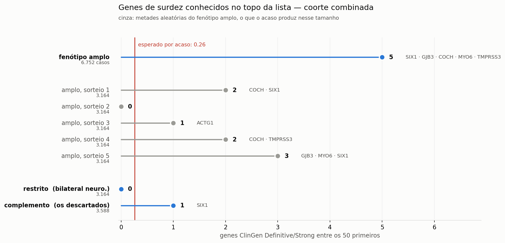

# Fase 5 — lendo o resultado · análise

**Autor:** Andre Rico · **Data:** 2026-10-08
**Cópia de trabalho pessoal, em português.** Não é página de Confluence.
Versão canônica: [`phase_5/results/FINDINGS.md`](../phase_5/results/FINDINGS.md) ·
Pontos em aberto: [`99_pontos_em_aberto.md`](99_pontos_em_aberto.md) · Fase anterior:
[`phase_04_analise_pt.md`](phase_04_analise_pt.md)

---

## O que esta fase faz

A Fase 4 produziu **471.615 testes de célula** e **53.640 p-valores de omnibus**. Ninguém olha para
isso.

Esta fase transforma em figura e tabela, e faz duas coisas que a Fase 4 não conseguia sozinha:
**verificar se o "não encontramos nada" é de verdade**, e **medir se a decisão de fenótipo custou
alguma coisa**.

---

## O resultado

| coorte | genes | **omnibus** | limiar `0,05/genes` | significativos |
|---|---:|---|---|---:|
| combined | 17.941 | 2,05 × 10⁻⁵ | 2,79 × 10⁻⁶ | **0** |
| EUR | 17.921 | 1,37 × 10⁻⁵ | 2,79 × 10⁻⁶ | **0** |
| AFR | 17.778 | 9,14 × 10⁻⁶ | 2,81 × 10⁻⁶ | **0** |

**Nenhum gene atinge significância.** O número principal é a linha `Cauchy` do próprio SAIGE — um
p-valor por gene, com o garimpo das nove células já cobrado.

### O caso que precisa ser contado antes que alguém o encontre

No EUR, **uma célula passa o limiar**:

| | p | limiar |
|---|---|---|
| `FBXO25`, melhor célula (pLOF) | **1,52 × 10⁻⁶** | 2,79 × 10⁻⁶ |
| `FBXO25`, omnibus | 1,37 × 10⁻⁵ | 2,79 × 10⁻⁶ |

A penalidade de busca dele é **9,0×** — o máximo possível —, ou seja, o sinal mora em exatamente uma
das nove células:

```
pLOF       1,5e-06   1,5e-06   1,5e-06     ← o mesmo teste três vezes
pDM        0,86      1,00      1,00
pLOF;pDM   3,2e-04   0,031     0,031
```

As três células de pLOF são **idênticas** porque todas as variantes são ultra-raras e o SAIGE as
colapsou numa unidade só — os três cortes de MAF selecionam o mesmo conjunto. É **um** teste, não
três.

E ele repousa em **18 alelos**: 7 entre 2.547 casos, 11 entre 37.596 controles. A diferença de taxa é
real (0,14% contra 0,015%), e o resultado inteiro se moveria se dois portadores fossem
reclassificados.

**A lição:** pegar o menor de nove testes correlacionados e comparar com um limiar feito para **um**
teste produz um gene significativo aqui. Cobrar pelas nove, que é o que o omnibus faz, não produz.
O `FBXO25` deve ser reportado como o que é — **o mais perto que chegamos, não um achado.**

---

## Conceito — os dois gráficos, e o que cada um responde

### O Manhattan

Os 22 cromossomos esticados lado a lado, cada gene um ponto, quanto mais alto mais forte a
associação. O nome vem da aparência: quando há achado, surgem torres acima do resto, como o skyline
de Manhattan.

A **linha vermelha** é o limiar. Com ~18 mil genes testados, muitos parecem interessantes por puro
azar — a linha é onde se separa o que resiste à correção.

Os nossos: [`figures/omnibus_<coorte>.png`](../figures/). **Nenhum ponto cruza a linha.** Não há
skyline — há uma cidade plana.

### O QQ

Este responde *"o teste está funcionando?"*, e é por isso que existe.

Se **nada** no estudo tivesse efeito, os p-valores ainda assim teriam distribuição previsível. O QQ
compara o **observado** com o **esperado** nesse mundo sem efeito algum.

| | significa |
|---|---|
| pontos **na diagonal** | o teste se comporta como deveria |
| pontos **acima** | inflação — os p-valores estão otimistas e não servem |
| pontos **abaixo** | conservador demais, esconderia achado real |

O resumo é o **λ**: 1,0 é perfeito.

### O que apareceu

```
combined   pDM 0,944   pLOF 0,964   pLOF;pDM 0,952
EUR        pDM 0,999   pLOF 0,958   pLOF;pDM 0,984
AFR        pDM 0,843   pLOF 0,664   pLOF;pDM 0,972
```

Perto de 1, levemente conservador. **Não está inflado**, o que invalidaria tudo; **não está
deflacionado** a ponto de esconder sinal. O 0,664 do AFR/pLOF é o único fora da faixa, e é a coorte
de 490 casos — tamanho, não método.

Isso é o que autoriza dizer **"não tem nada aí"** em vez de só *"nada passou"*.

---

## A pergunta que esta fase existe para responder

A Fase 1 cortou os casos de 6.752 para 3.164, por critério clínico. **Isso custou biologia?**

Montamos a pergunta com a lista do **ClinGen** — o painel de especialistas que adjudica quais genes
realmente causam surdez. São **100 genes** Definitive/Strong, 93 presentes no nosso conjunto.

Se os genes conhecidos estiverem no topo da lista mais do que o acaso permite, o ranking carrega
biologia. Se não, é ruído ordenado.

### Primeiro resultado — e ele assustou

| | casos | ClinGen no top-50 | esperado |
|---|---:|---:|---:|
| fenótipo **amplo** (`SO_396`) | 6.752 | **5** | 0,26 |
| fenótipo **restrito** (o nosso) | 3.164 | **0** | 0,26 |

Cinco dos cinquenta melhores do braço amplo são genes de surdez estabelecidos — `SIX1`, `GJB3`,
`COCH`, `MYO6`, `TMPRSS3` — onde o acaso prevê **um quarto de um**. p = 5,9 × 10⁻⁶.

No nosso, **nenhum dos 93 aparece no top-250**.

A leitura tentadora: a restrição jogou fora os casos que carregavam a biologia. **Não se sustenta**,
e foram dois controles que mostraram isso.

### Controle 1 — segurar o tamanho fixo

Metade dos casos sumiu junto com a restrição. Então: pegar o fenótipo **amplo**, sortear **3.164**
casos — o número exato do restrito —, e rodar tudo de novo. Cinco vezes, porque um sorteio só pode
dar sorte.

```
amplo, 6.752 casos          5 genes ClinGen no top-50
amplo a 3.164, 5 sorteios   2, 0, 1, 2, 3
restrito, 3.164             0
```

**O enriquecimento não é artefato de tamanho** — agrupando os sorteios, 8 genes em 250 vagas contra
1,3 esperados, p = 6,4 × 10⁻⁵.

**Mas o zero do restrito está dentro da faixa do acaso.** Os sorteios dão média 1,6, e
P(0 | Poisson 1,6) = 0,20. Um dos cinco também deu zero.

### Controle 2 — rodar os casos descartados

Os casos restritos são **subconjunto estrito** dos amplos, então o complemento é exatamente os
**3.588 que a restrição descarta**.

```
complemento, 3.588 casos    1 gene (SIX1)    p = 0,23
```

**Nenhuma das duas metades carrega o enriquecimento, e nenhuma é anormal.** E elas não somam:
0 + 1 = 1, contra 5 do conjunto inteiro.

### Os quatro braços numa figura



Em cinza, as cinco metades aleatórias — **o que o acaso produz nesse tamanho**. Em azul, os três
braços reais. O restrito (0) e o complemento (1) caem **dentro** da nuvem cinza; só o conjunto
completo, com 6.752 casos, sai dela.

### A conclusão

**O enriquecimento precisa dos 6.752 casos juntos.** O nulo da restrição é **perda de poder, não
perda de sinal** — a decisão de fenótipo sai limpa.

O motivo é banal depois de dito: com 3.164 casos **nada neste estudo é detectável**, então qual
3.164 você escolhe quase não importa. O sinal é fino o bastante para só emergir com todos.

E o que isso **não** diz: não que a restrição seja melhor. Só que não é pior pelo motivo que se
suspeitava.

---

## Uma coisa que registrei por honestidade

Escrevi, entre o primeiro resultado e os controles, que *"a restrição remove sinal"*. **Estava
errado**, e os controles que eu mesmo desenhei mostraram isso.

O `FINDINGS.md` carrega as **três versões** do achado — *"provavelmente nada"* → *"remove sinal"* →
*"não resolvido, e eis por quê"* → a conclusão final. A sequência é a parte útil: uma observação, uma
inferência errada dela, dois controles, e uma conclusão que contradiz a inferência.

Em ambos os controles a **regra de decisão foi escrita no script antes do resultado existir**.
Importou: eu já tinha publicado a afirmação que o teste podia confirmar.

---

## Em aberto

Nenhum item desta fase bloqueia nada — o triagem completa está em
[`99_pontos_em_aberto.md`](99_pontos_em_aberto.md). Os dois que são desta fase:

- **O `FBXO25` merece uma olhada**, não como achado mas como o mais próximo. 18 alelos, 7 em casos.
  Se a coorte crescer, é o primeiro a conferir.
- **Os 6 genes ClinGen no cromossomo X** (`AIFM1`, `COL4A5`, `POU3F4`, `PRPS1`, `SMPX`, `TIMM8A`)
  não foram testados, porque as máscaras cobrem 1 a 22. Cobrimos 94 de 100.
