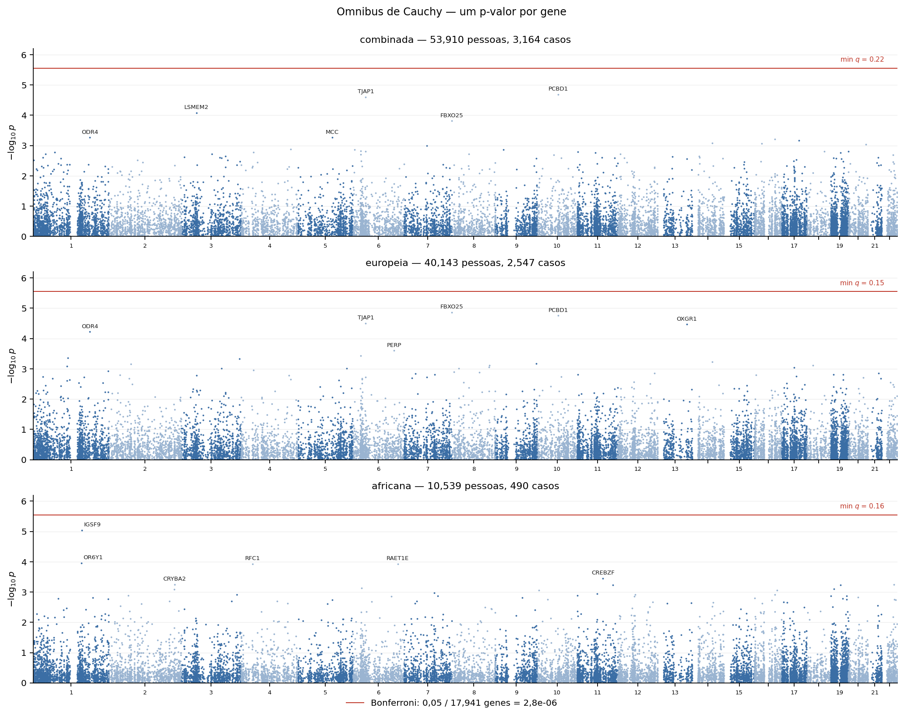
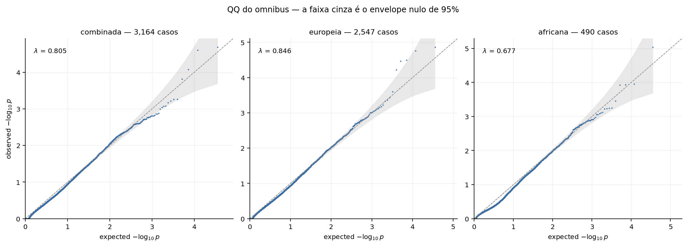

# Phase 5 — Results

**Bilateral sensorineural hearing loss · PMBB Release 2026-4.0**
[← Phase 4 — the test](04_test.md) · Part 5 of 5 · [Conclusions →](06_conclusions.md)

---

## In one line

**No gene reaches exome-wide significance in any cohort** — and the test is calibrated, so that is a
real absence rather than a deflated analysis.

---

## The result

| cohort | genes | omnibus p | bar `0.05/genes` | significant |
|---|---:|---|---|---:|
| combined | 17,941 | 2.05 × 10⁻⁵ | 2.79 × 10⁻⁶ | **0** |
| EUR | 17,921 | 1.37 × 10⁻⁵ | 2.79 × 10⁻⁶ | **0** |
| AFR | 17,778 | 9.14 × 10⁻⁶ | 2.81 × 10⁻⁶ | **0** |



Nothing crosses the line in any cohort. The `min q` on each panel is the smallest FDR q-value:
0.22, 0.15 and 0.16 — nothing under Benjamini-Hochberg either.

---

## `FBXO25` — read this before quoting the cell-level table

In EUR, one **cell** does clear the per-gene bar:

| | p | bar |
|---|---|---|
| `FBXO25`, best cell (pLOF) | **1.52 × 10⁻⁶** | 2.79 × 10⁻⁶ |
| `FBXO25`, omnibus | 1.37 × 10⁻⁵ | 2.79 × 10⁻⁶ |

Its search penalty is **9.0×**, the maximum — the signal sits in exactly one cell of nine:

```
pLOF       1.5e-06   1.5e-06   1.5e-06      ← the same test three times
pDM        0.86      1.00      1.00
pLOF;pDM   3.2e-04   0.031     0.031
```

The three pLOF cells are identical because every variant is ultra-rare and SAIGE collapsed them into
one unit, so the three MAF cutoffs select the same set. It is **one** test, not three. And it rests
on **18 alleles — 7 among 2,547 cases, 11 among 37,596 controls.**

Taking the smallest of nine correlated tests and setting it against a bar built for one test
produces a significant gene here; charging for the nine does not. `FBXO25` is **the closest thing to
a signal, not a finding** — and the first gene to check if the cohort ever grows.

---

## The absence is real

"Nothing passed the bar" and "there is nothing here" are different claims, and a conservative test
produces the first without supporting the second.



Points hug the diagonal and stay inside the null envelope. λ for the omnibus is 0.805, 0.846 and
0.677 — below 1 because the omnibus has already charged for nine looks, which is conservative by
design. At the cell level, where that charge has not been applied, λ runs 0.944 to 0.999.

Neither inflated, which would make the p-values meaningless, nor deflated enough to hide signal.

---

## Does the ranking carry biology?

The one positive result in this work, and it needed two controls to state correctly.

Tested against the **ClinGen Hearing Loss panel** — 100 Definitive/Strong genes, 93 of them in our
tested set. If a ranking carries biology, they sit near its top more than chance allows.


| | cases | ClinGen in top 50 | expected |
|---|---:|---:|---:|
| broad `SO_396` phenotype | 6,752 | **5** | 0.26 |
| broad, drawn down to 3,164, five times | 3,164 | 2 · 0 · 1 · 2 · 3 | 0.26 |
| **this analysis** (bilateral SN) | 3,164 | **0** | 0.26 |
| the cases this phenotype discards | 3,588 | 1 | 0.26 |

### What the two controls establish

**Control 1 — hold sample size fixed.** The broad phenotype drawn down to 3,164 cases, five times,
and rerun end to end. Pooled: 8 ClinGen genes in 250 top-50 slots against 1.3 expected,
**p = 6.4 × 10⁻⁵**. The enrichment is not an artefact of sample size.

**Control 2 — run the discarded cases.** The restricted cases are a strict subset of the broad ones,
so the complement is exactly the 3,588 this phenotype drops. It returns 1 gene, p = 0.23.

**Neither half carries the enrichment, and neither is unusual.** Against the random-half
distribution (mean 1.6): the restricted arm's 0 has P(≤0) = 0.20, the complement's 1 has P(≤1) =
0.53. And they do not add up — 0 + 1 against 5 for the whole.

### The conclusion

**The restriction's null is lost power, not lost signal.** The phenotype decision is not shown to
discard biology.

The reason is ordinary once stated: at 3,164 cases nothing in this study is detectable, so *which*
3,164 you take barely matters. The signal only clears the noise with every case in.

What this does **not** say: that the restriction is better — only that it is not worse for the
reason that was suspected.

---

## Known limitations

- **AFR, 490 cases, τ₂ = 0.** Run because omitting it is its own reporting bias, but it carries
  almost no power. `IGSF9` tops it at 9.14 × 10⁻⁶ against a bar of 2.81 × 10⁻⁶ — the closest any
  cohort came, in the cohort least able to support it.
- **No X chromosome**, costing 6 of the 100 ClinGen genes.
- **One observation of the restricted arm.** It is a fixed set, not a draw, so its result cannot be
  placed in a distribution the way the five draws can.

---

*Detail: [`phase_5/results/FINDINGS.md`](../phase_5/results/FINDINGS.md) ·
controls: [`phase_5/power_control/`](../phase_5/power_control/README.md) ·
[`phase_5/complement/`](../phase_5/complement/README.md)*
