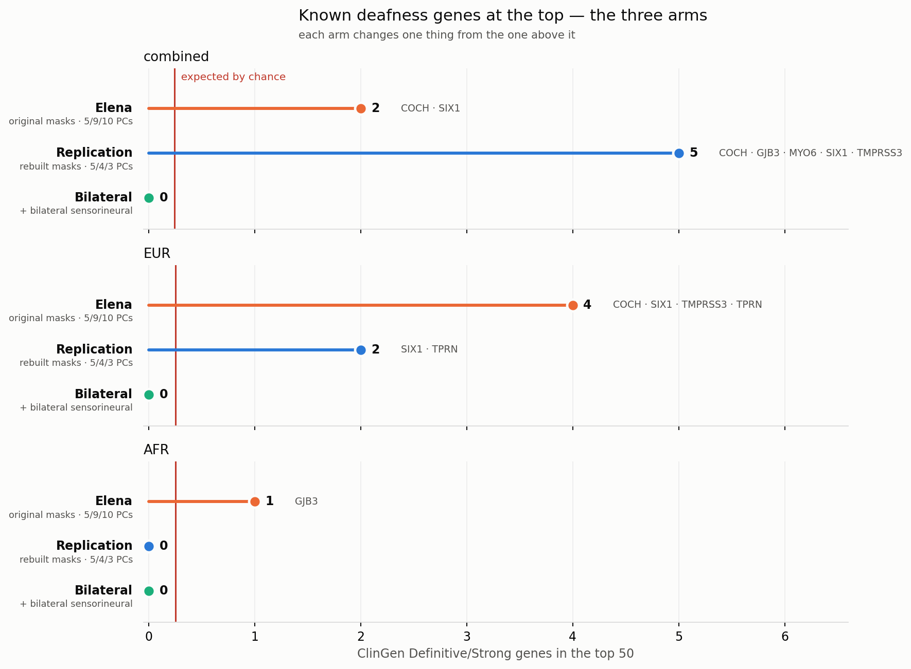

# Conclusions

**Bilateral sensorineural hearing loss · PMBB Release 2026-4.0**
[← Phase 5 — results](05_results.md) · [Introduction & pipeline](00_introduction.md)

---

## The verdict

**No gene reaches exome-wide significance.** Not in any cohort, under Bonferroni or FDR, at any
level of aggregation. The closest is `FBXO25` in EUR at 1.37 × 10⁻⁵ against a bar of 2.79 × 10⁻⁶ —
an order of magnitude short once the nine-cell search is charged for.

**The absence is real, not a deflated test.** λ runs 0.68 to 1.00, the QQ points stay inside the
null envelope, and nothing replicates across ancestries beyond chance.

**The limit is the cohort, not the method.** 3,164 cases is small for rare-variant burden, and 6,752
was not large either. This is what the three arms below agree on.

---

## Three arms, one question

The analysis exists alongside two others, and each changes **one thing** from the one before it:

| arm | phenotype | masks | PCs |
|---|---|---|---|
| **Elena** | `SO_396` broad | original | 5 / 9 / 10 |
| **Replication** | `SO_396` broad | rebuilt | 5 / 4 / 3 |
| **Bilateral** *(this work)* | bilateral sensorineural | rebuilt | 5 / 4 / 3 |

So **Elena → Replication** isolates the mask and PC corrections, and **Replication → Bilateral**
isolates the phenotype decision.

To compare them, Elena's arm was given a per-gene omnibus computed the same way — her pipeline emits
none, since its `Cauchy` rows combine annotations inside a cell and leave about nine per gene.

### What the comparison shows

**No arm has a significant gene.** Three phenotype-and-method combinations, none crosses the bar.

**The rankings are not noise.** ClinGen Definitive/Strong deafness genes cluster near the top of two
arms more than chance allows — `Replication / combined` at 5 against 0.26 expected
(p = 5.9 × 10⁻⁶), `Elena / EUR` at 4 (p = 1.1 × 10⁻⁴). **This is the one positive result in the
work:** these orderings carry real biology, which a null headline might otherwise suggest they
do not.

### What the comparison does **not** show

The figure invites two stories — *our corrections found the biology*, and *the restriction destroyed
it*. **Neither is supported.** Fisher's exact between every pair of arms:

| cohort | comparison | counts | p |
|---|---|---|---|
| combined | Elena vs Replication | 2 vs 5 | 0.436 |
| combined | Replication vs Bilateral | 5 vs 0 | 0.056 |
| EUR | Elena vs Replication | 4 vs 2 | 0.678 |
| EUR | Replication vs Bilateral | 2 vs 0 | 0.495 |

**Not one pair is distinguishable**, and that test is already optimistic — the arms share people,
genes and controls, so they are not independent.

The counts run 0 to 5 against an expectation of 0.26. Differences among numbers that small are not
measurable here, and reading the figure instead of the table is how a claim gets made that the data
cannot carry.

---

## What the phenotype decision cost

Tested properly rather than argued about. Restricting to bilateral sensorineural halves the cases,
and the ClinGen enrichment disappears — which looks like evidence the restriction discards real
biology. Two controls say otherwise:

| | cases | ClinGen in top 50 |
|---|---:|---:|
| broad phenotype | 6,752 | 5 |
| broad, drawn down to 3,164, five times | 3,164 | 2 · 0 · 1 · 2 · 3 |
| bilateral sensorineural | 3,164 | **0** |
| the cases it discards | 3,588 | 1 |

The five size-matched draws are the yardstick: with the broad definition and 3,164 cases, between 0
and 3 is what can be found, mean 1.6. The restricted arm's 0 sits **inside** that range —
P(0 | Poisson 1.6) = 0.20, and one of the five draws also returned zero. The complement, run as its
own case set, returns 1.

**Neither half carries the enrichment, and they do not add up: 0 + 1 against 5 for the whole.**

> **The restriction's null is lost power, not lost signal.** The phenotype decision is not shown to
> discard biology. It is also not shown to be *better* — only that it is not worse for the reason
> suspected.

---

## What is worth carrying forward

**`FBXO25`** — the closest thing to a signal. In EUR one cell reaches 1.52 × 10⁻⁶, below the
per-gene bar, but the omnibus is 1.37 × 10⁻⁵ with the maximum search penalty, and it rests on 18
alleles, 7 of them in cases. Not a finding; the first gene to check if the cohort grows.

**`SIX1`** — the most consistent gene across everything run. Top 50 in the full broad arm, in two of
five random draws, and the only one in the complement's top 50. Still two orders of magnitude from
significance.

**`GJB3`** — connexin 31, DFNA2B. Shows the behaviour a real gene would: signal concentrated in the
rarest variants, diluting as commoner ones enter.

All three are flags, not results. With ~18,000 genes tested, a known deafness gene landing high by
chance is unremarkable; what makes these worth noting is that identity and behaviour point the same
way.

---

## Next steps

**1 · Audiograms — the one that changes the question.** Diagnosis codes are a proxy.
`H91.90 Unspecified hearing loss, unspecified ear` alone covers 2,698 people who have hearing loss
the record does not characterise, and no phenotyping rule can recover what was never written down.
Audiograms are quantitative and settle type and laterality without inference. The blocker is a
REDCap-to-PMBB ID bridge that does not exist yet.

> "we certainly think the audiograms are going to be a safer bet" — **D. Epstein**, 2026-10-02

When that bridge exists, **only Phase 1 changes**; Phases 2 through 5 run unaltered.

**2 · A larger cohort.** All of Us or UK Biobank. This is what the null asks for, and it is the
third sense of "replication" — reproducing a finding in independent data — that neither this work
nor the replication addresses.

**3 · The X chromosome.** Currently uncovered, costing 6 of the 100 ClinGen Definitive/Strong genes:
`AIFM1`, `COL4A5`, `POU3F4`, `PRPS1`, `SMPX`, `TIMM8A`. Coverage is 94%. Closing it needs X masks
and SAIGE handling hemizygosity in males.

**4 · Open clinical question.** Sudden idiopathic hearing loss (`SO_396.5`, 203 people in the broad
definition) is currently excluded. Whether it belongs in a genetic study of age-related loss is a
question for the clinical side, not a statistical one.

**Deliberately not next:** sensitivity analyses on REVEL 0.5 vs 0.6 or SpliceAI 0.2 vs 0.5. They
would move the ranking but not the conclusion, and running sensitivity analyses on a null result
produces more null results. They become worth doing if the cohort grows.

---

## In three sentences

This cohort, at this size, does not support a rare-variant gene burden finding for bilateral
sensorineural hearing loss, and the test is calibrated well enough that the absence is informative
rather than inconclusive. The rankings underneath that null do carry known deafness biology, which
means the pipeline is working and the signal is simply below the detection floor. What stands
between this result and a finding is sample size and phenotype quality — not analysis choices.

---

## Appendix — the top 50 of each arm

Combined cohort. p-values are the per-gene omnibus in every arm, so the three columns are the same
quantity. **‡** marks a ClinGen Definitive or Strong hearing-loss gene, **†** one at a weaker
classification.

Counts: **Elena 2**, **Replication 5**, **Bilateral 0** at Definitive/Strong — against 0.26 expected
by chance in each. The caveat from the comparison above applies: no pair of these counts is
statistically distinguishable from another.

Two things to notice while scanning.

`TMC3-AS1` is **rank 1 in Elena's arm** and absent from the other two. It is an `lncRNA` — a gene
with no protein — so a loss-of-function burden test on it cannot mean anything, and the whole result
rests on two variants. It was removed by the mask rebuild, along with 1,101 other non-coding genes.
This is the clearest single example of why Phase 2 mattered.

`FBXO25` sits at rank 4 of the Bilateral arm. One of its nine cells clears the per-gene bar; its
omnibus does not. [Phase 5](05_results.md) explains why.

| # | Elena | p | Replication | p | Bilateral | p |
|---:|---|---|---|---|---|---|
| 1 | `TMC3-AS1` | 5e-06 | `PSG8` | 3e-05 | `PCBD1` | 2.1e-05 |
| 2 | `PSG8` | 5.4e-05 | `PSMA7` | 3.9e-05 | `TJAP1` | 2.5e-05 |
| 3 | `PTPN23` | 7.2e-05 | `BPTF` | 4.5e-05 | `LSMEM2` | 8.3e-05 |
| 4 | `EFCAB12` | 8.6e-05 | `SIX1` **‡** | 9.3e-05 | `FBXO25` | 0.00015 |
| 5 | `MCC` | 0.00011 | `LSMEM2` | 0.00012 | `MCC` | 0.00054 |
| 6 | `PSMA7` | 0.00012 | `PTPN23` | 0.00013 | `ODR4` | 0.00054 |
| 7 | `CLEC4E` | 0.00021 | `TSPAN33` | 0.00019 | `ENKD1` | 0.00061 |
| 8 | `GRIK1` | 0.00028 | `CLEC4E` | 0.00035 | `C17orf67` | 0.00067 |
| 9 | `TSPAN33` | 0.00029 | `CHP2` | 0.00041 | `PALS1` | 0.00083 |
| 10 | `C17orf67` | 0.00031 | `LGALS8` | 0.00046 | `CHP2` | 0.00085 |
| 11 | `COCH` **‡** | 0.00036 | `GYS2` | 0.00064 | `APCDD1L` | 0.0009 |
| 12 | `GYS2` | 0.00037 | `THAP3` | 0.00086 | `TMEM120A` | 0.001 |
| 13 | `GOLGA6L9` | 0.00041 | `EPS8L2` † | 0.00095 | `MSMO1` | 0.0013 |
| 14 | `NUP153-AS1` | 0.00072 | `ATP5ME` | 0.001 | `RREB1` | 0.0014 |
| 15 | `RAB39A` | 0.00076 | `RIPPLY3` | 0.001 | `LRRC19` | 0.0014 |
| 16 | `FXYD1` | 0.0008 | `C17orf67` | 0.001 | `H2BC12` | 0.0015 |
| 17 | `SIX1` **‡** | 0.00092 | `MAP1LC3A` | 0.0012 | `ZNF446` | 0.0015 |
| 18 | `LETM1` | 0.00097 | `ME3` | 0.0013 | `MALT1` | 0.0016 |
| 19 | `AGAP13P` | 0.0011 | `GJB3` **‡** | 0.0013 | `POLH` | 0.0016 |
| 20 | `LRRC19` | 0.0011 | `ZKSCAN8` | 0.0013 | `INS` | 0.0016 |
| 21 | `EDARADD` | 0.0012 | `JPH4` | 0.0013 | `SHISA3` | 0.0017 |
| 22 | `ZKSCAN8` | 0.0012 | `ST8SIA6` | 0.0013 | `SRSF11` | 0.0017 |
| 23 | `CHL1` | 0.0012 | `COCH` **‡** | 0.0014 | `ZNF507` | 0.0017 |
| 24 | `CIMIP1` | 0.0012 | `GLT8D2` | 0.0015 | `TMEM109` | 0.0017 |
| 25 | `MFSD4A` | 0.0013 | `RGSL1` | 0.0016 | `PENK` | 0.0019 |
| 26 | `FDPS` | 0.0014 | `PCED1B` | 0.0016 | `BMP8B` | 0.0019 |
| 27 | `WDR43` | 0.0014 | `C17orf58` | 0.0016 | `CLEC4E` | 0.0019 |
| 28 | `TGM1` | 0.0014 | `FAM81B` | 0.0017 | `ZBTB11` | 0.0019 |
| 29 | `DNAH2` | 0.0015 | `TJAP1` | 0.0018 | `BTN2A1` | 0.0019 |
| 30 | `PGD` | 0.0016 | `CIMIP1` | 0.0019 | `ZWINT` | 0.002 |
| 31 | `JPH4` | 0.0016 | `PGS1` | 0.0019 | `CYTH4` | 0.0021 |
| 32 | `PRSS46P` | 0.0017 | `PCBD1` | 0.002 | `ABHD4` | 0.0022 |
| 33 | `PAK6` | 0.0018 | `CHL1` | 0.002 | `PLSCR2` | 0.0023 |
| 34 | `MEN1` | 0.0018 | `MYO6` **‡** | 0.0023 | `LPAR6` | 0.0023 |
| 35 | `EXTL1` | 0.0019 | `IL1RN` | 0.0025 | `SETD5` | 0.0024 |
| 36 | `EEFSEC` | 0.0019 | `TMPRSS3` **‡** | 0.0026 | `KCNE2` | 0.0025 |
| 37 | `ETS1` | 0.0021 | `OR10G8` | 0.0027 | `DDIAS` | 0.0025 |
| 38 | `AVIL` | 0.0022 | `RAE1` | 0.0027 | `SNRNP40` | 0.0025 |
| 39 | `RTBDN` | 0.0022 | `CST7` | 0.0027 | `PRR23E` | 0.0025 |
| 40 | `PCED1B` | 0.0022 | `USP4` | 0.003 | `CTSG` | 0.0025 |
| 41 | `IL1RN` | 0.0024 | `DES` | 0.003 | `GYS2` | 0.0025 |
| 42 | `C17orf58` | 0.0024 | `CCNL1` | 0.003 | `OR10G8` | 0.0025 |
| 43 | `NT5C2` | 0.0025 | `GRIK1` | 0.0031 | `SRPRB` | 0.0026 |
| 44 | `TJAP1` | 0.0025 | `VEZF1` | 0.0032 | `ADAMTS10` | 0.0026 |
| 45 | `CATSPER4` | 0.0028 | `ZNF644` | 0.0035 | `PLAC9` | 0.0026 |
| 46 | `DDX60L` | 0.0029 | `SAMM50` | 0.0035 | `HSP90AA1` | 0.0026 |
| 47 | `BIVM` | 0.003 | `CFH` | 0.0035 | `RAB3A` | 0.0026 |
| 48 | `ACAN` | 0.003 | `PRKG1` | 0.0035 | `UBAC1` | 0.0026 |
| 49 | `PITX3` | 0.0031 | `FGF7` | 0.0037 | `ZNF644` | 0.0026 |
| 50 | `ZNF654` | 0.0031 | `FAM86B1` | 0.0038 | `OXGR1` | 0.0027 |

*Full tables for all three cohorts, with each arm's rank and ClinGen classification:
`phase_5/results/top50_{combined,EUR,AFR}.tsv`*

---

*Full detail: [`phase_5/results/FINDINGS.md`](../phase_5/results/FINDINGS.md) ·
three-way notebook: [`phase_5/notebooks/01_three_way.ipynb`](../phase_5/notebooks/01_three_way.ipynb) ·
premises and their sources: [`PREMISES.md`](../PREMISES.md) ·
open items, triaged: [`andre_notes/99_pontos_em_aberto.md`](../andre_notes/99_pontos_em_aberto.md)*
